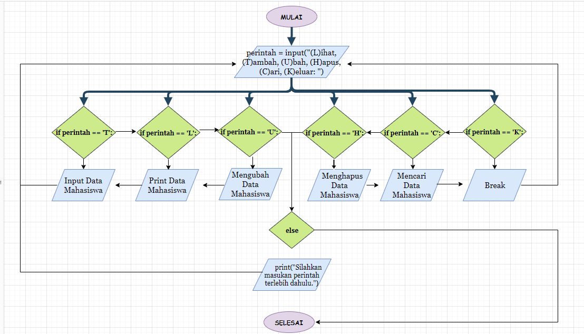
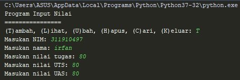
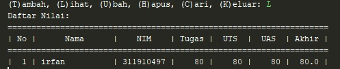
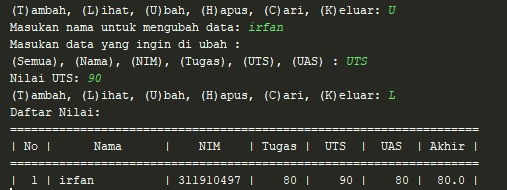
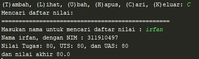
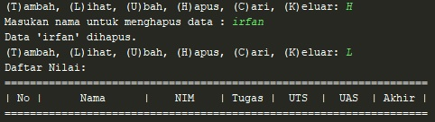

# Praktikum5

## Tugas pertemuan ke 10 Bahasa Pemrograman

## Nama  : Prayudha Ragil Musthofa

## NIM   : 312210726

## Kelas : TI.22.C.9

# Program Input Nilai Mahasiswa

1. Program dibuat menggunakan dictionary
2. Akan disediakan beberapa pilihan, nantinya pengguna dapat memilih menu yang tersedia seperti L,T,U,H,C,K
3. Dengan menggunakan elemen elif dan if atau percabangan
4. Ketik t (tambah) maka user akan diminta untuk memasukan biodata beserta nilai2 nya perolehan nilai dari akumulasi antara tugas x 0.30 uts x 0.35 uas x 0.35
5. Ketik u (ubah) maka user akan diminta memasukan nama if nama adalah keys dari dictionary data maka akan diminta mengisi kembali yang akan di ganti,
6. Ketik h maka user akan diminta menginputkan nama if nama adalah keys maka akan terhapus semua values nya juga
7. Ketik c (cari) user akan diminta menginputkan nama if nama adalah keys maka akan tercetak values2 nya
8. Ketik l (lihat) maka akan ditampilkan semua data yang di input beserta nilai nilainya dalam bentuk tabel
9. Ketik k (keluar) maka user akan keluar dari program.

## Flowchart

## Program Nilai

perintah = input("(L)ihat, (T)ambah, (U)bah, (H)apus, (C)ari, (K)eluar: ")
## Masukan huruf T untuk menginput data (Daftar Nilai)
 (T)ambah
 # (T)ambah
    if perintah.lower() == 't':
        nim = input("Masukan NIM: ")
        nama = input("Masukan nama: ")
@@ -25,7 +25,7 @@ perintah = input("(L)ihat, (T)ambah, (U)bah, (H)apus, (C)ari, (K)eluar: ")
 

## Masukan huruf L untuk melihat Daftar Nilai
(L)ihat
# (L)ihat
    elif perintah.lower() == 'l':
        print("Daftar Nilai:")
        print("===================================================================")
@@ -41,7 +41,7 @@ perintah = input("(L)ihat, (T)ambah, (U)bah, (H)apus, (C)ari, (K)eluar: ")
 

## Masukan huruf U untuk mengubah data mahasiswa
(U)bah
# (U)bah
    elif perintah.lower() == 'u':
        nama = input("Masukan nama untuk mengubah data: ")
        if nama in daftar.keys():
@@ -72,7 +72,7 @@ perintah = input("(L)ihat, (T)ambah, (U)bah, (H)apus, (C)ari, (K)eluar: ")
            print("'{}' tidak ditemukan.".format(nama))

## Masukan huruf C untuk mencari data nilai mahasiswa
(C)ari
# (C)ari
    elif perintah.lower() == 'c':
        print("Mencari daftar nilai: ")
        print("=================================================")
@@ -88,7 +88,7 @@ perintah = input("(L)ihat, (T)ambah, (U)bah, (H)apus, (C)ari, (K)eluar: ")

## Masukan huruf H untuk menghapus data nilai mahasiswa
(H)apus
# (H)apus
    elif perintah.lower() == 'h':
        nama = input("Masukan nama untuk menghapus data : ")
        if nama in daftar.keys():
@@ -99,10 +99,12 @@ perintah = input("(L)ihat, (T)ambah, (U)bah, (H)apus, (C)ari, (K)eluar: ")

## Masukan huruf K untuk keluar/selesai
(K)eluar
# (K)eluar
    elif perintah.lower() == 'k':
        break

    else:
        print("Silahkan masukan perintah terlebih dahulu.")

# Sekian dan Terimakasih

